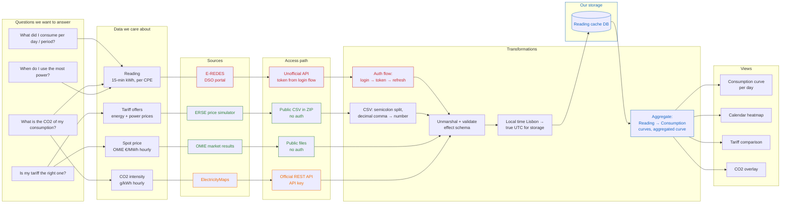

# Data flow map

Status: living document. Update whenever a source, access path, or
transformation changes.

The map has two parts:

1. A flow diagram: questions → data → sources → access → transformations.
2. A source table: one row per source, with frequency and access details.

## How to read the diagram

- Green = public / free access
- Orange = API key required (official, paid or rate-limited)
- Red = unofficial access (auth meant for humans, can break without notice)
- Blue = data we own (our DB, our aggregates)

## Source table

| Source          | Data                                              | Update frequency                             | Access                  | Auth                                                  | Notes                                                          |
| --------------- | ------------------------------------------------- | -------------------------------------------- | ----------------------- | ----------------------------------------------------- | -------------------------------------------------------------- |
| E-REDES         | Reading (15-min kWh)                              | ~D+1, published per day                      | Unofficial API          | Session token from login flow; expires, needs refresh | Only `A+` register today; future `A-` for solar                |
| ERSE simulator  | Tariff offers (all liberalized offers ≤ 41.4 kVA) | Periodic re-publication (path changes)       | Public CSV ZIP, no auth | None                                                  | Discover path via `Settings.json` → `csvPath`; do not hardcode |
| OMIE            | Spot price €/MWh, hourly                          | Daily, after market close (~13:00–18:00 CET) | Public files, no auth   | None                                                  | Portugal + Spain zones                                         |
| ElectricityMaps | CO2 intensity g/kWh                               | Hourly (historical) / live (real-time)       | Official REST API       | API key, free tier is rate-limited                    | Zone PT                                                        |

## Open questions

- Estimated vs. real readings: which E-REDES flag marks them, and where do we
  store that?
- Does the tariff comparison need invoice periods (22nd–21st) or are civil
  months enough? (currently future scope)
- Which OMIE price applies: day-ahead hourly, or a fixed indexed formula?
